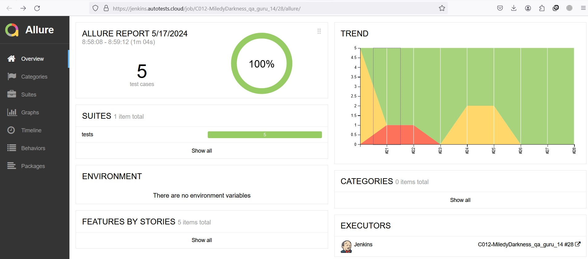
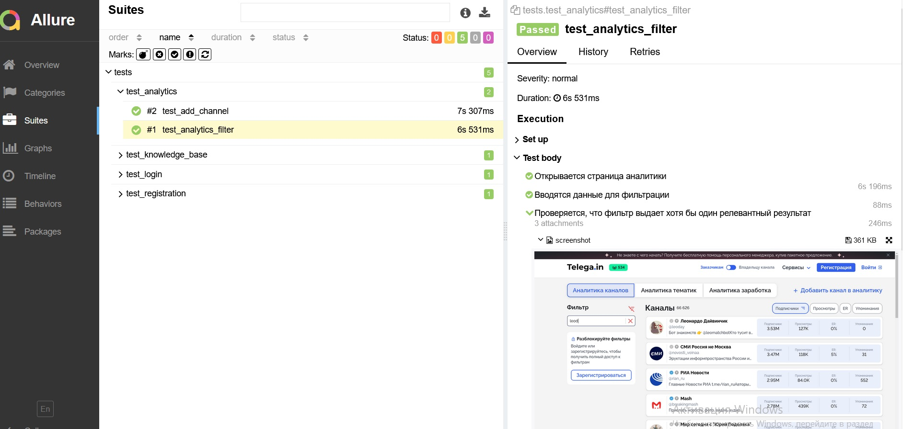
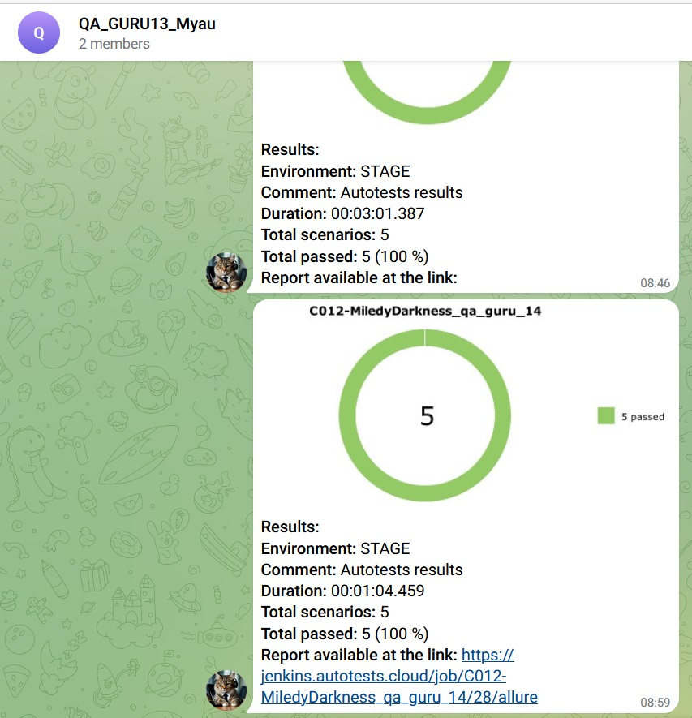

##### Здесь предаставлено несколько простых автотестов для сайта https://telega.in/
###### Все тесты реализованы с использованием шаблона PageObject
<ul>
<li>test_registration - проверяет, что нельзя зарегистрироваться с неправильным email</li>
<li>test_login - проверяет, что нельзя войти без логина и пароля</li>
<li>test_knowledge_base - проверяет, что поиск выдает корректные результаты</li>
<li>test_analytics_filter -проверяет, что фильтр выдает корректные результаты</li>
<li>test_add_channel - проверяет, что нельзя добавить канал с пустыми полями</li>
</ul>

#### История запусков тестового набора

#### Пример выполнения одного теста

#### Сообщение в телеграмм о выполнении тестов

